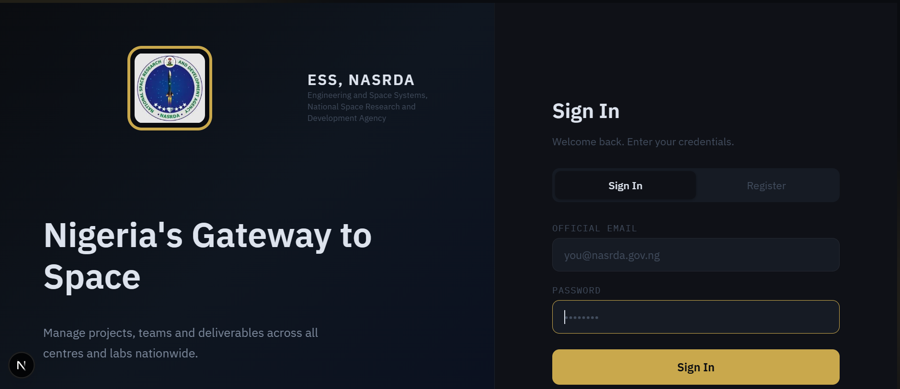
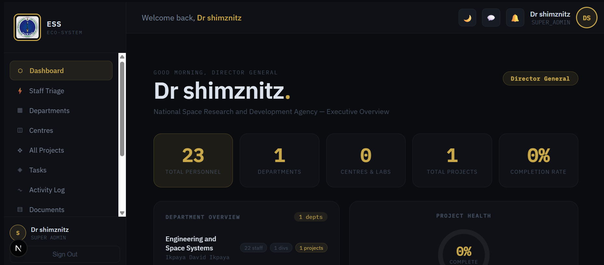
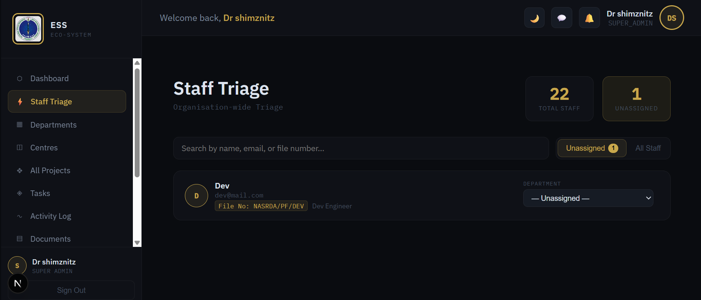
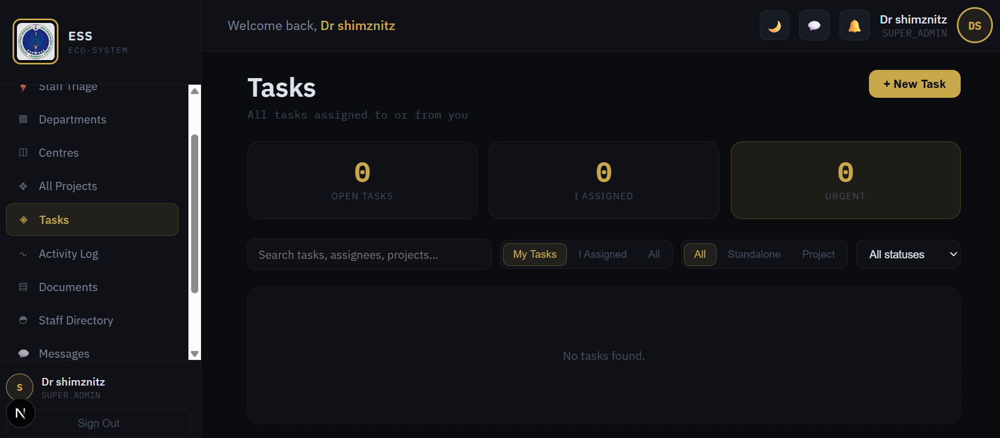
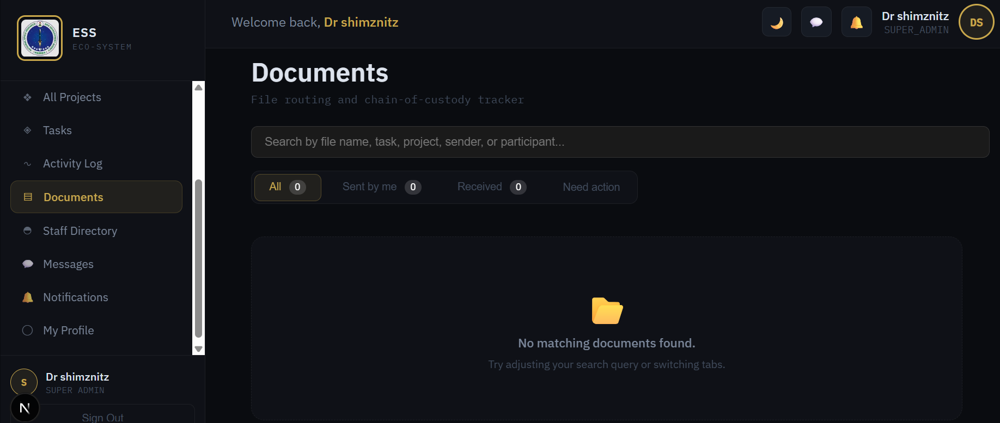

This is a [Next.js](https://nextjs.org) project bootstrapped with [`create-next-app`](https://nextjs.org/docs/app/api-reference/cli/create-next-app).

## Getting Started

# NASRDA Staff & Project Management Portal

A full-stack, enterprise-grade internal staff and operational project management workspace built for the National Space Research and Development Agency (NASRDA).

##  Key Features
- **Six-Tier Role-Based Access Control (RBAC):** Dynamic role hierarchy (Super Admin, Centre Head, Division Head, Unit Head, Staff) enforced via PostgreSQL Row-Level Security (RLS).
- **Hierarchical Project & Task Workspaces:** Support for parent-child project structures, multi-member delegation, and progress tracking.
- **Debounced Staff Search:** Auto-complete staff lookup with instant state resets to prevent UI flickering and unneeded network queries.
- **Honorific-Aware Profile Handling:** Smart name formatting (`getDisplayName` / `getInitials`) supporting formal titles (Dr., Engr., Prof.).
- **Real-Time Notification System:** Automated WhatsApp notifications integrated via the Meta Cloud API.

##  Tech Stack
- **Frontend:** Next.js 14 (App Router), React, TypeScript, Custom CSS
- **Backend & Database:** Supabase, PostgreSQL, Row-Level Security (RLS)
- **Integrations:** Meta Cloud API (WhatsApp Business)
- **Deployment:** Vercel

##  Interface Preview
*(Add your screenshots here)*







### Prerequisites
- Node.js 18+
- Supabase Account & Project

### Environment Variables
Create a `.env.local` file in the root directory:
```env
NEXT_PUBLIC_SUPABASE_URL=your_supabase_project_url
NEXT_PUBLIC_SUPABASE_ANON_KEY=your_supabase_anon_key

First, run the development server:

```bash
npm run dev
# or
yarn dev
# or
pnpm dev
# or
bun dev
```

Open [http://localhost:3000](http://localhost:3000) with your browser to see the result.

You can start editing the page by modifying `app/page.tsx`. The page auto-updates as you edit the file.

This project uses [`next/font`](https://nextjs.org/docs/app/building-your-application/optimizing/fonts) to automatically optimize and load [Geist](https://vercel.com/font), a new font family for Vercel.

## Learn More

To learn more about Next.js, take a look at the following resources:

- [Next.js Documentation](https://nextjs.org/docs) - learn about Next.js features and API.
- [Learn Next.js](https://nextjs.org/learn) - an interactive Next.js tutorial.

You can check out [the Next.js GitHub repository](https://github.com/vercel/next.js) - your feedback and contributions are welcome!

## Deploy on Vercel

The easiest way to deploy your Next.js app is to use the [Vercel Platform](https://vercel.com/new?utm_medium=default-template&filter=next.js&utm_source=create-next-app&utm_campaign=create-next-app-readme) from the creators of Next.js.

Check out our [Next.js deployment documentation](https://nextjs.org/docs/app/building-your-application/deploying) for more details.
